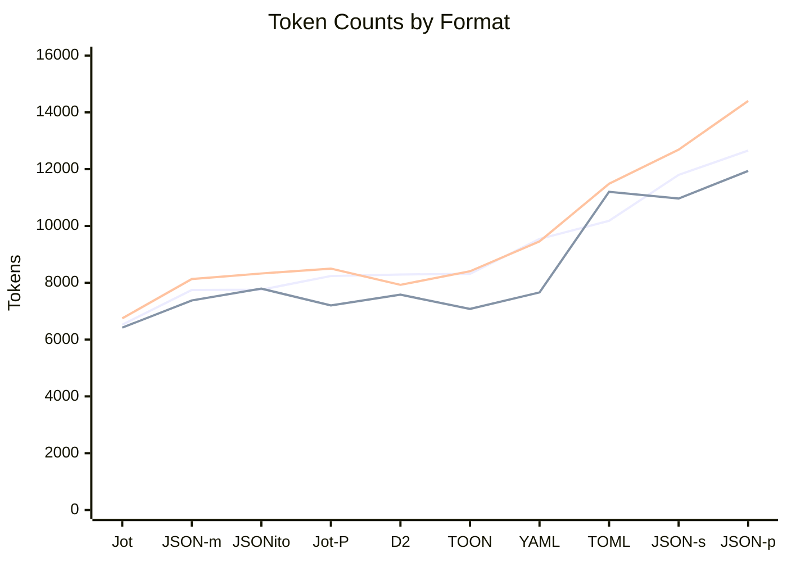

# Encoding Format Comparison

Token counts for 18 test documents across three tokenizers. For LLM systems, **tokens matter more than bytes**.

## Recommendation

**Use Jot** for LLM contexts — saves 16-17% tokens vs JSON.

## Token Efficiency

<!-- CHART_START -->

<!-- CHART_END -->

### Compact Formats

For machine-to-machine or LLM contexts where readability isn't required.

<!-- COMPACT_START -->
| Format                                              | Qwen           | Legacy         | Claude         | Bytes          |
|-----------------------------------------------------|---------------:|---------------:|---------------:|---------------:|
| **[Jot](jot/)**                                     |   6,525 (-16%) |   6,420 (-13%) |   6,747 (-17%) |  16,621 (-28%) |
| [JSON](https://www.json.org/) (mini)                |          7,748 |          7,377 |          8,132 |         23,119 |
| [JSONito](https://github.com/creationix/jsonito)    |    7,757 (+0%) |    7,794 (+6%) |    8,327 (+2%) |  14,059 (-39%) |
| [D2](https://github.com/creationix/d2)              |    8,292 (+7%) |    7,582 (+3%) |    7,928 (-3%) |  17,328 (-25%) |
<!-- COMPACT_END -->

### Pretty-Printed Formats

For human-readable output or when LLMs need to read/write structured data.

<!-- PRETTY_START -->
| Format                                              | Qwen           | Legacy         | Claude         | Bytes          |
|-----------------------------------------------------|---------------:|---------------:|---------------:|---------------:|
| **[Jot](jot/) (pretty)**                            |   8,239 (-35%) |   7,204 (-40%) |   8,500 (-41%) |  23,676 (-41%) |
| [TOON](toon/)                                       |   8,315 (-34%) |   7,079 (-41%) |   8,405 (-42%) |  22,780 (-43%) |
| [YAML](https://yaml.org/)                           |   9,543 (-25%) |   7,661 (-36%) |   9,456 (-34%) |  26,757 (-33%) |
| [TOML](https://toml.io/)                            |  10,180 (-20%) |   11,204 (-6%) |  11,485 (-20%) |  28,930 (-27%) |
| [JSON](json/smart-json.ts) (smart)                  |   11,799 (-7%) |   10,966 (-8%) |  12,687 (-12%) |  32,657 (-18%) |
| [JSON](https://www.json.org/) (pretty)              |         12,656 |         11,937 |         14,403 |         39,884 |
<!-- PRETTY_END -->

## Format Descriptions

### [Jot](jot/)

JSON with three optimizations:

1. **Unquoted strings** — omit quotes unless value contains `: ; , { } [ ] "` or parses as number/boolean/null
2. **Key folding** — `{a:{b:1}}` → `{a.b:1}` for single-key nested objects
3. **Tables** — `[{a:1},{a:2}]` → `{{:a;1;2}}` for repeating object schemas

```jot
{config.host:localhost,users:{{:id,name;1,Alice;2,Bob}}}
```

It also has a pretty-printed variant that adds indentation and newlines for readability.

```jot
{
  config.host: localhost,
  users: {{
    :id, name;
      1, Alice;
      2, Bob
  }}
}
```

### [TOON](toon/)

YAML-like indentation with optional table syntax and count guards.

```toon
users[2]{id,name}:
  1,Alice
  2,Bob
```

### [JSONito](https://github.com/creationix/jsonito)

Byte-optimized JSON with string deduplication via preamble dictionary.

```jito
{name'config'version'5~1.0.0enabled'!a~maxRetries6.timeout'eFw.tags'[a~productionapi'v1']}
```

### [D2](https://github.com/creationix/d2)

Declarative data format using `=` assignment and shell-like quoting.

## Why Not Byte-Optimized Formats?

Formats like JSONito achieve excellent byte compression (-39%) but:

- Token savings are inconsistent (small docs often cost more than JSON)
- Deduplication preambles add overhead that doesn't scale down
- LLMs cannot reliably generate formats requiring state tracking

## LLM Encoding Ability

Tested Qwen3-30b's ability to encode JSON → Jot (3 runs per document, 17 docs):

| Document Type                                | Semantic Accuracy |
|----------------------------------------------|------------------:|
| Simple configs (small, metrics, package)     |              100% |
| Key folding test cases                       |              100% |
| Table-friendly (users-50)                    |              100% |
| Text-heavy (chat)                            |              100% |
| Complex/nested (large, firewall, routes)     |                0% |
| Irregular schemas (medium, hikes, irregular) |                0% |
| **Overall**                                  |           **47%** |

Small models struggle with Jot's advanced features on complex documents. For LLM-generated output, consider using simpler Jot (unquoted strings only) or providing FORMAT.md as context.

## Tokenizers

- **Qwen**: Qwen3-Coder-30b via LM Studio API
- **Legacy**: Anthropic legacy tokenizer (`@anthropic-ai/tokenizer`)
- **Claude**: Claude API token counting endpoint (Sonnet/Opus/Haiku share tokenizer)

## Test Data

18 documents covering diverse structures:

| Document          | Description                      |
|-------------------|----------------------------------|
| small             | Config object (6 fields)         |
| medium            | User list with metadata          |
| large             | Kubernetes deployment spec       |
| hikes             | Tabular records (uniform schema) |
| chat              | LLM conversation (text-heavy)    |
| metrics           | Time series (numeric-heavy)      |
| package           | npm manifest (nested deps)       |
| github-issue      | Mixed nesting with labels        |
| irregular         | Event log (varying keys)         |
| users-50          | 50 user records (table-friendly) |
| logs              | 50 log entries (semi-uniform)    |
| firewall          | WAF rules (deeply nested)        |
| products          | E-commerce catalog (variants)    |
| routes            | API routing config (large tables)|
| key-folding-*     | Key folding test cases           |
| json-counts-cache | Cached token counts              |
