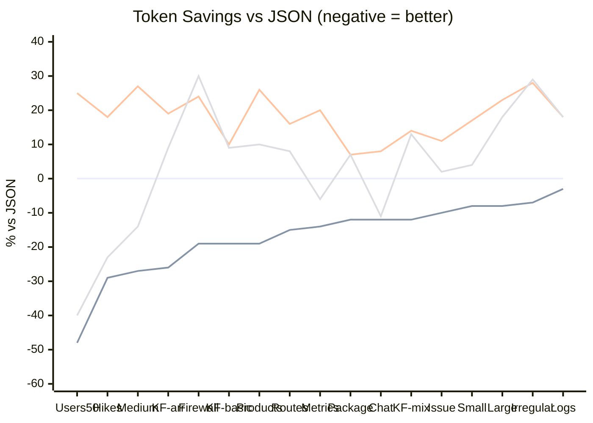
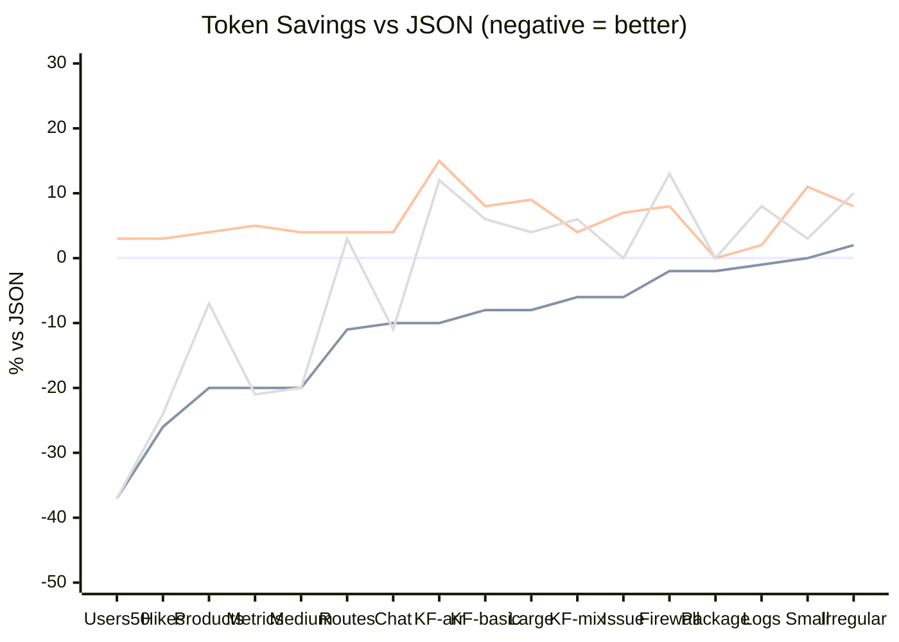
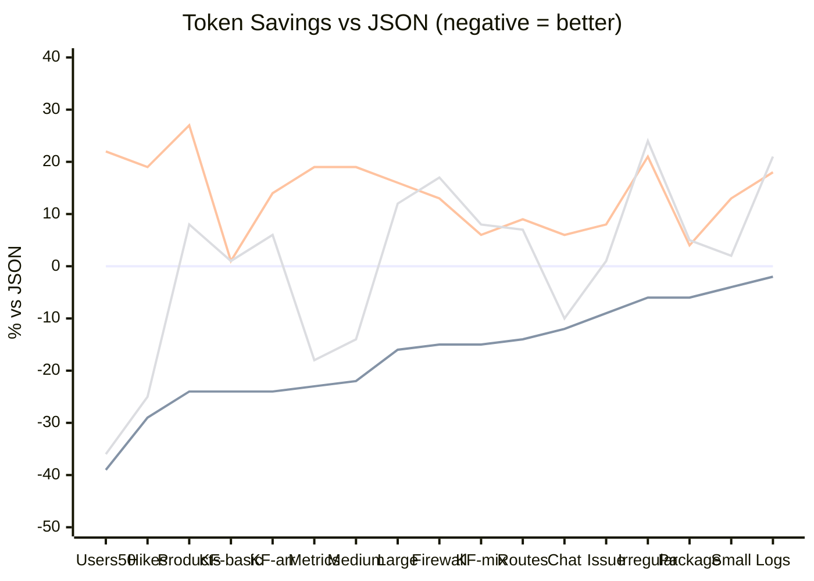

# Token Counts by Format

## Qwen Tokenizer (LM Studio)

Tokens measured using **Qwen3-Coder-30b** via LM Studio API. This is the primary tokenizer used for testing local model efficiency.

<!-- QWEN_CHART_START -->

<!-- QWEN_CHART_END -->

### Per-File Breakdown (Qwen)

<!-- QWEN_TABLE_START -->
| Format | Chat | Firewall | Issue | Hikes | Irregular | KF-basic | KF-mix | KF-arr | Large | Logs | Medium | Metrics | Package | Products | Routes | Small | Users50 | Total |
|--------|------:|------:|------:|------:|------:|------:|------:|------:|------:|------:|------:|------:|------:|------:|------:|------:|------:|------:|
| Jot | [67](jot/chat.jot) | [669](jot/firewall.jot) | [79](jot/github-issue.jot) | [112](jot/hikes.jot) | [63](jot/irregular.jot) | [47](jot/key-folding-basic.jot) | [69](jot/key-folding-mixed.jot) | [43](jot/key-folding-with-array.jot) | [246](jot/large.jot) | [2044](jot/logs.jot) | [71](jot/medium.jot) | [101](jot/metrics.jot) | [85](jot/package.jot) | [702](jot/products.jot) | [1246](jot/routes.jot) | [44](jot/small.jot) | [663](jot/users-50.jot) | 6,351 |
| JSONito | [86](jsonito/chat.jito) | [919](jsonito/firewall.jito) | [89](jsonito/github-issue.jito) | [158](jsonito/hikes.jito) | [59](jsonito/irregular.jito) | [62](jsonito/key-folding-basic.jito) | [82](jsonito/key-folding-mixed.jito) | [63](jsonito/key-folding-with-array.jito) | [312](jsonito/large.jito) | [1941](jsonito/logs.jito) | [103](jsonito/medium.jito) | [89](jsonito/metrics.jito) | [101](jsonito/package.jito) | [846](jsonito/products.jito) | [1426](jsonito/routes.jito) | [45](jsonito/small.jito) | [1234](jsonito/users-50.jito) | 7,615 |
| JSON-m | [76](json/chat.json) | [827](json/firewall.json) | [88](json/github-issue.json) | [158](json/hikes.json) | [68](json/irregular.json) | [58](json/key-folding-basic.json) | [78](json/key-folding-mixed.json) | [58](json/key-folding-with-array.json) | [266](json/large.json) | [2108](json/logs.json) | [97](json/medium.json) | [117](json/metrics.json) | [97](json/package.json) | [866](json/products.json) | [1459](json/routes.json) | [48](json/small.json) | [1279](json/users-50.json) | 7,748 |
| Jot-P | [73](jot/chat.pretty.jot) | [1119](jot/firewall.pretty.jot) | [105](jot/github-issue.pretty.jot) | [142](jot/hikes.pretty.jot) | [91](jot/irregular.pretty.jot) | [54](jot/key-folding-basic.pretty.jot) | [96](jot/key-folding-mixed.pretty.jot) | [52](jot/key-folding-with-array.pretty.jot) | [365](jot/large.pretty.jot) | [2304](jot/logs.pretty.jot) | [100](jot/medium.pretty.jot) | [123](jot/metrics.pretty.jot) | [120](jot/package.pretty.jot) | [828](jot/products.pretty.jot) | [1521](jot/routes.pretty.jot) | [59](jot/small.pretty.jot) | [863](jot/users-50.pretty.jot) | 8,015 |
| D2 | [80](d2/chat.d2) | [894](d2/firewall.d2) | [97](d2/github-issue.d2) | [173](d2/hikes.d2) | [81](d2/irregular.d2) | [60](d2/key-folding-basic.d2) | [80](d2/key-folding-mixed.d2) | [67](d2/key-folding-with-array.d2) | [316](d2/large.d2) | [2092](d2/logs.d2) | [104](d2/medium.d2) | [138](d2/metrics.d2) | [90](d2/package.d2) | [994](d2/products.d2) | [1536](d2/routes.d2) | [55](d2/small.d2) | [1202](d2/users-50.d2) | 8,059 |
| TOON | [68](toon/chat.toon) | [1073](toon/firewall.toon) | [90](toon/github-issue.toon) | [122](toon/hikes.toon) | [88](toon/irregular.toon) | [63](toon/key-folding-basic.toon) | [88](toon/key-folding-mixed.toon) | [63](toon/key-folding-with-array.toon) | [313](toon/large.toon) | [2492](toon/logs.toon) | [83](toon/medium.toon) | [110](toon/metrics.toon) | [104](toon/package.toon) | [954](toon/products.toon) | [1574](toon/routes.toon) | [50](toon/small.toon) | [763](toon/users-50.toon) | 8,098 |
| YAML | [82](yaml/chat.yaml) | [1029](yaml/firewall.yaml) | [98](yaml/github-issue.yaml) | [187](yaml/hikes.yaml) | [87](yaml/irregular.yaml) | [64](yaml/key-folding-basic.yaml) | [89](yaml/key-folding-mixed.yaml) | [69](yaml/key-folding-with-array.yaml) | [327](yaml/large.yaml) | [2487](yaml/logs.yaml) | [123](yaml/medium.yaml) | [140](yaml/metrics.yaml) | [104](yaml/package.yaml) | [1095](yaml/products.yaml) | [1696](yaml/routes.yaml) | [56](yaml/small.yaml) | [1597](yaml/users-50.yaml) | 9,330 |
| TOML | [84](toml/chat.toml) | [1495](toml/firewall.toml) | [99](toml/github-issue.toml) | [189](toml/hikes.toml) | [86](toml/irregular.toml) | [60](toml/key-folding-basic.toml) | [85](toml/key-folding-mixed.toml) | [61](toml/key-folding-with-array.toml) | [377](toml/large.toml) | [2498](toml/logs.toml) | [118](toml/medium.toml) | [139](toml/metrics.toml) | [104](toml/package.toml) | [1114](toml/products.toml) | [1790](toml/routes.toml) | [56](toml/small.toml) | [1625](toml/users-50.toml) | 9,980 |
<!-- QWEN_TABLE_END -->

---

## Legacy Claude Tokenizer

Tokens measured using **@anthropic-ai/tokenizer** (Claude's legacy tokenizer). This is the older tokenizer used by earlier Claude models.

<!-- LEGACY_CHART_START -->

<!-- LEGACY_CHART_END -->

### Per-File Breakdown (Legacy)

<!-- LEGACY_TABLE_START -->
| Format | Chat | Metrics | Large | KF-mix | Logs | Firewall | Small | Issue | Users50 | Medium | Hikes | Package | KF-basic | Irregular | KF-arr | Products | Routes | Total |
|--------|------:|------:|------:|------:|------:|------:|------:|------:|------:|------:|------:|------:|------:|------:|------:|------:|------:|------:|
| Jot | [63](jot/chat.jot) | [60](jot/metrics.jot) | [221](jot/large.jot) | [65](jot/key-folding-mixed.jot) | [1737](jot/logs.jot) | [825](jot/firewall.jot) | [36](jot/small.jot) | [68](jot/github-issue.jot) | [837](jot/users-50.jot) | [76](jot/medium.jot) | [103](jot/hikes.jot) | [91](jot/package.jot) | [45](jot/key-folding-basic.jot) | [49](jot/irregular.jot) | [47](jot/key-folding-with-array.jot) | [613](jot/products.jot) | [1352](jot/routes.jot) | 6,288 |
| JSON-m | [70](json/chat.json) | [75](json/metrics.json) | [239](json/large.json) | [69](json/key-folding-mixed.json) | [1750](json/logs.json) | [845](json/firewall.json) | [36](json/small.json) | [72](json/github-issue.json) | [1326](json/users-50.json) | [95](json/medium.json) | [139](json/hikes.json) | [93](json/package.json) | [49](json/key-folding-basic.json) | [48](json/irregular.json) | [52](json/key-folding-with-array.json) | [771](json/products.json) | [1516](json/routes.json) | 7,245 |
| YAML | [73](yaml/chat.yaml) | [79](yaml/metrics.yaml) | [260](yaml/large.yaml) | [72](yaml/key-folding-mixed.yaml) | [1780](yaml/logs.yaml) | [911](yaml/firewall.yaml) | [40](yaml/small.yaml) | [77](yaml/github-issue.yaml) | [1365](yaml/users-50.yaml) | [99](yaml/medium.yaml) | [143](yaml/hikes.yaml) | [93](yaml/package.yaml) | [53](yaml/key-folding-basic.yaml) | [52](yaml/irregular.yaml) | [60](yaml/key-folding-with-array.yaml) | [799](yaml/products.yaml) | [1572](yaml/routes.yaml) | 7,528 |
| TOON | [62](toon/chat.toon) | [59](toon/metrics.toon) | [249](toon/large.toon) | [73](toon/key-folding-mixed.toon) | [1885](toon/logs.toon) | [955](toon/firewall.toon) | [37](toon/small.toon) | [72](toon/github-issue.toon) | [836](toon/users-50.toon) | [76](toon/medium.toon) | [105](toon/hikes.toon) | [93](toon/package.toon) | [52](toon/key-folding-basic.toon) | [53](toon/irregular.toon) | [58](toon/key-folding-with-array.toon) | [720](toon/products.toon) | [1557](toon/routes.toon) | 6,942 |
<!-- LEGACY_TABLE_END -->

Note: The legacy tokenizer may produce different results than modern Claude models, but is useful for comparison and runs locally without API calls.

---

## Modern Claude Tokenizer

Tokens measured using **Claude API** token counting endpoint (claude-sonnet-4). This represents the actual token usage for modern Claude models. Token counting is free via the API.

<!-- CLAUDE_CHART_START -->

<!-- CLAUDE_CHART_END -->

### Per-File Breakdown (Claude)

<!-- CLAUDE_TABLE_START -->
| Format | Chat | Metrics | Large | KF-mix | Logs | Firewall | Small | Issue | Users50 | Medium | Hikes | Package | KF-basic | Irregular | KF-arr | Products | Routes | Total |
|--------|------:|------:|------:|------:|------:|------:|------:|------:|------:|------:|------:|------:|------:|------:|------:|------:|------:|------:|
| Jot | [71](jot/chat.jot) | [68](jot/metrics.jot) | [241](jot/large.jot) | [76](jot/key-folding-mixed.jot) | [1762](jot/logs.jot) | [867](jot/firewall.jot) | [44](jot/small.jot) | [78](jot/github-issue.jot) | [830](jot/users-50.jot) | [83](jot/medium.jot) | [115](jot/hikes.jot) | [99](jot/package.jot) | [53](jot/key-folding-basic.jot) | [59](jot/irregular.jot) | [53](jot/key-folding-with-array.jot) | [634](jot/products.jot) | [1472](jot/routes.jot) | 6,605 |
| JSON-m | [81](json/chat.json) | [88](json/metrics.json) | [286](json/large.json) | [89](json/key-folding-mixed.json) | [1798](json/logs.json) | [1022](json/firewall.json) | [46](json/small.json) | [86](json/github-issue.json) | [1369](json/users-50.json) | [107](json/medium.json) | [163](json/hikes.json) | [105](json/package.json) | [70](json/key-folding-basic.json) | [63](json/irregular.json) | [70](json/key-folding-with-array.json) | [839](json/products.json) | [1707](json/routes.json) | 7,989 |
| YAML | [86](yaml/chat.yaml) | [105](yaml/metrics.yaml) | [333](yaml/large.yaml) | [94](yaml/key-folding-mixed.yaml) | [2118](yaml/logs.yaml) | [1152](yaml/firewall.yaml) | [52](yaml/small.yaml) | [93](yaml/github-issue.yaml) | [1666](yaml/users-50.yaml) | [127](yaml/medium.yaml) | [194](yaml/hikes.yaml) | [109](yaml/package.yaml) | [71](yaml/key-folding-basic.yaml) | [76](yaml/irregular.yaml) | [80](yaml/key-folding-with-array.yaml) | [1063](yaml/products.yaml) | [1857](yaml/routes.yaml) | 9,276 |
| TOON | [73](toon/chat.toon) | [72](toon/metrics.toon) | [319](toon/large.toon) | [96](toon/key-folding-mixed.toon) | [2175](toon/logs.toon) | [1195](toon/firewall.toon) | [47](toon/small.toon) | [87](toon/github-issue.toon) | [879](toon/users-50.toon) | [92](toon/medium.toon) | [123](toon/hikes.toon) | [110](toon/package.toon) | [71](toon/key-folding-basic.toon) | [78](toon/irregular.toon) | [74](toon/key-folding-with-array.toon) | [907](toon/products.toon) | [1822](toon/routes.toon) | 8,220 |
<!-- CLAUDE_TABLE_END -->

Note: Run `ANTHROPIC_API_KEY=... bun scripts/count-claude-tokens.ts` to regenerate Claude counts.
